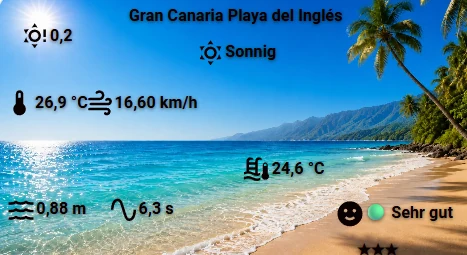

# Beach Weather

[English](README.md) · **Deutsch**

Home-Assistant-Integration für Strand- und Wasserbedingungen (Wassertemperatur, Wellen, Wind, Badebedingungen), auf Basis der kostenlosen [Open-Meteo](https://open-meteo.com/) Marine- und Forecast-APIs — ohne API-Schlüssel.

## Funktionen

- Beliebig viele Standorte, jeder als eigener Config-Entry — Koordinaten manuell eingeben oder auf der Karte auswählen
- Wassertemperatur, Wellenhöhe/-periode, Windgeschwindigkeit/Böen/Richtung, dazu ein berechneter Sensor für die Badebedingungen
- Eine normale `weather.<slug>`-Entity pro Standort mit stündlicher und täglicher Vorhersage, für die native Wetterkarte
- Passende Lovelace-Karte, [Beach Weather Card](https://github.com/LuckyTriple7/ha-beach-weather-card) (`custom:beach-weather-card`) — Sensorwerte frei über einem Strandfoto positionieren; separat über HACS installiert
- Alle Anfragen sämtlicher Standorte laufen über einen gemeinsamen Rate-Limiter — auch viele Standorte feuern nie parallel auf Open-Meteo (vermeidet HTTP 403)
- Automatischer Fehler-Backoff bei 403/429
- Konfiguration komplett über die HA-Oberfläche, kein YAML nötig
- Einstellbares Abfrageintervall (Standard 900 s / 15 min, passend zum Aktualisierungsrhythmus von Open-Meteo)

## Installation über HACS

1. HACS öffnen → **Integrationen** → Menü (⋮) → **Benutzerdefinierte Repositories**
2. URL eintragen: `https://github.com/LuckyTriple7/ha-beach-weather`
3. Kategorie: **Integration** → **Hinzufügen**
4. Nach **Beach Weather** suchen → **Herunterladen**
5. Home Assistant neu starten

## Konfiguration

1. **Einstellungen → Geräte & Dienste → Integration hinzufügen → Beach Weather**
2. Optional das Feld **Koordinaten einfügen oder Ort suchen** nutzen: entweder ein „lat, lon"-Paar (z. B. direkt aus Google Maps kopiert) oder ein Ortsname als Freitext (z. B. „Maspalomas beach"), dann absenden — das füllt Karte, Namensvorschlag und vorgeschlagene Strandausrichtung vor, ohne den Standort schon anzulegen
3. Namen eingeben/bestätigen (z. B. „Platja de Muro") und den Standort festlegen — Koordinaten direkt eintippen oder auf der Karte wählen
4. Optional das Abfrageintervall anpassen (min. 300 s)
5. Die **Strandausrichtung** setzen/bestätigen (° Kompass, seewärts) — der Surf Score beurteilt damit, ob Wind- und Swell-Richtung günstig stehen

Für jeden weiteren Standort die Integration erneut hinzufügen. Alle Vorschläge sind Näherungen (Nominatim für Ortssuche und Name, nächstgelegenes OSM-Küstensegment via Overpass für die Ausrichtung) — vor dem Speichern prüfen, besonders die Ausrichtung an Buchten oder komplizierten Küstenlinien.

> Nach einem Update über HACS Home Assistant **neu starten** (kein bloßer Reload der Integration) — neue Übersetzungstexte werden nur bei einem vollen Neustart übernommen.

## Entitäten

Ein HA-Gerät pro Standort, benannt nach dem Standort. Home Assistant leitet die Entity-IDs aus dem Gerätenamen und dem Namen der jeweiligen Entität ab, hier am Beispiel „Platja de Muro":

| Entität | Beschreibung |
|--------|-------------|
| `sensor.platja_de_muro_water_temperature` | Wasseroberflächentemperatur (°C) |
| `sensor.platja_de_muro_wave_height` | Wellenhöhe (m) |
| `sensor.platja_de_muro_wave_direction` | Gesamt-Wellenrichtung (°) |
| `sensor.platja_de_muro_wave_period` | Wellenperiode (s) |
| `sensor.platja_de_muro_swell_height` | Swell-Wellenhöhe (m) — surfrelevant, getrennt von lokaler Windsee |
| `sensor.platja_de_muro_swell_direction` | Swell-Richtung (°) |
| `sensor.platja_de_muro_swell_period` | Swell-Periode (s) — Qualitätssignal fürs Surfen, getrennt von der gemischten Wellenperiode; Grundlage des Surf Score |
| `sensor.platja_de_muro_wind_wave_height` | Windsee-Höhe (m) — lokal windgetriebene Kabbelung, getrennt vom Swell |
| `sensor.platja_de_muro_wind_wave_direction` | Windsee-Richtung (°) |
| `sensor.platja_de_muro_wind_wave_period` | Windsee-Periode (s) |
| `sensor.platja_de_muro_ocean_current_velocity` | Strömungsgeschwindigkeit (km/h) |
| `sensor.platja_de_muro_ocean_current_direction` | Strömungsrichtung (°) |
| `sensor.platja_de_muro_timestamp` | Zeitstempel der Marine-Daten |
| `sensor.platja_de_muro_wind_speed` | Windgeschwindigkeit (km/h) |
| `sensor.platja_de_muro_wind_gusts` | Windböen (km/h) |
| `sensor.platja_de_muro_wind_direction` | Windrichtung (°) |
| `sensor.platja_de_muro_air_temperature` | Lufttemperatur in 2 m (°C) |
| `sensor.platja_de_muro_humidity` | Relative Luftfeuchte (%) |
| `sensor.platja_de_muro_precipitation` | Niederschlag im aktuellen Intervall (mm) |
| `sensor.platja_de_muro_rain` | Regen im aktuellen Intervall (mm) |
| `sensor.platja_de_muro_showers` | Schauer im aktuellen Intervall (mm) |
| `sensor.platja_de_muro_pressure` | Luftdruck auf Meereshöhe (hPa) |
| `sensor.platja_de_muro_cloud_cover` | Bewölkung (%) |
| `sensor.platja_de_muro_uv_index` | UV-Index |
| `sensor.platja_de_muro_visibility` | Horizontale Sichtweite (km) |
| `sensor.platja_de_muro_day_night` | Tag/Nacht |
| `sensor.platja_de_muro_weather_condition` | Wetterlage im Klartext (aus dem WMO-Code), mit dem Rohcode als Attribut |
| `sensor.platja_de_muro_wind_timestamp` | Zeitstempel der Wind-/Wetterdaten |
| `sensor.platja_de_muro_bathing_conditions` | Berechnete Badebedingungen als Text/Icon (ohne eigenen API-Aufruf) |
| `sensor.platja_de_muro_location` | Statischer Anzeigename des Standorts |
| `sensor.platja_de_muro_marine_api_status` | Letzter roher HTTP-Statuscode der Marine-API (Diagnose) |
| `sensor.platja_de_muro_weather_api_status` | Letzter roher HTTP-Statuscode der Forecast-/Wind-API (Diagnose) |
| `button.platja_de_muro_update_now` | Erzwingt sofortiges Aktualisieren beider APIs für diesen Standort — umgeht den gemeinsamen Rate-Limiter und einen aktiven Fehler-Backoff |
| `sensor.platja_de_muro_surf_score` | Surf-Qualität, 0-100 |
| `sensor.platja_de_muro_surf_condition` | Surf-Qualität als Kategorie (Kein Surf / Schlecht / Okay / Gut / Sehr gut / Perfekte Bedingungen) |
| `sensor.platja_de_muro_surf_stars` | Surf-Qualität als Sternebewertung (★ bis ★★★★★), mit Punktzahl und Sternanzahl als Attribute |
| `weather.platja_de_muro` | Standard-HA-Wetterentity — aktuelle Bedingungen plus stündliche/tägliche Vorhersage |

> Standorte, die mit 0.24.0 oder früher angelegt wurden, behalten ihre damaligen IDs (`sensor.water_temperature_platja_de_muro`) — die Entity-Registry schreibt eine bestehende ID nie um, ein Update auch nicht. Nur ab 1.1.0 neu angelegte Standorte nutzen das obige Schema. Die Lovelace-Karte sucht ihre Entities über den `translation_key` der Registry und kommt deshalb mit beiden Formen zurecht — auch mit selbst umbenannten Entities.

Ein Sensor wird `unavailable`, wenn Open-Meteo für dieses Feld keinen Wert liefert oder die Anfrage scheitert. Ausnahme sind die beiden „Last Status"-Sensoren: Sie bleiben auch nach einem fehlgeschlagenen Update sichtbar und zeigen den rohen Statuscode (z. B. `403`), damit ein Rate-Limit-Problem ohne Log-Suche erkennbar ist.

Die 12 Marine-Sensoren (Wassertemperatur, Wellenhöhe/-richtung/-periode, Swell-Höhe/-Richtung/-Periode, Windsee-Höhe/-Richtung/-Periode, Strömungsgeschwindigkeit/-richtung) tragen jeweils ein `forecast`-Attribut — die nächsten 48 Stunden als `[{"time": ..., "value": ...}, ...]`, `null` solange keine Vorhersagedaten vorliegen.

## Wetter-Entity

`weather.<slug>` ist eine normale Home-Assistant-Wetterentity — funktioniert mit der eingebauten Wetterkarte, mit `weather.get_forecasts` und allem anderen, das eine gewöhnliche `weather.*`-Entity erwartet. Sie deckt nur die atmosphärische Seite ab (Temperatur, Wind, Luftdruck, Feuchte, Bewölkung, UV-Index, Sicht, Niederschlag, Wetterlage) aus den `current`/`hourly`/`daily`-Blöcken der Forecast-API — Wellen-, Swell- und Surf-Daten haben im Wettermodell von HA nichts verloren und bleiben auf den eigenen Sensoren oben. WMO-Wettercodes werden auf HAs Standard-Zustände abgebildet (`sunny`/`clear-night` für Codes 0-1, tag-/nachtabhängig; `partlycloudy`, `cloudy`, `fog`, `rainy`, `pouring`, `snowy`, `snowy-rainy`, `lightning`, `lightning-rainy` für den Rest).

## Lovelace-Karte

Die Karte hat ein eigenes Repository: **[Beach Weather Card](https://github.com/LuckyTriple7/ha-beach-weather-card)** (`custom:beach-weather-card`) — die Sensorwerte eines Standorts frei über einem Strandfoto positioniert, per Drag & Drop im Karteneditor.

Installation über HACS → **Dashboard** → **Beach Weather Card**. HACS registriert die Lovelace-Ressource selbst; diese Integration schreibt nicht in deinen Ressourcen-Speicher.

> **Umstieg von 0.24.0 oder älter:** Die Karte steckte bisher in dieser Integration, die dafür eine Lovelace-Ressource mit Ziel `/beach_weather_static/beach-weather-card.js` registriert hat. Version 1.0.0 entfernt diese Ressource beim nächsten Start und bedient den Pfad nicht mehr — die Karte also über HACS installieren, um sie weiter zu nutzen. Bestehende Dashboards müssen nicht angepasst werden: gleicher Kartentyp, gleiches Konfigurationsformat, gleiche Entity-IDs.

## Schwellenwerte für Badebedingungen

Die Schwellenwerte des Badebedingungs-Sensors (Kältegrenze, ruhige/mäßige Wellenhöhe, perfekte/sehr gute Wassertemperatur, perfekte Wellenperiode) gelten **global für alle Standorte**, nicht pro Standort. Anpassen über **Einstellungen → Geräte & Dienste → Beach Weather → Konfigurieren** (bei einem beliebigen Standort) → **Schwellenwerte für Badebedingungen** — dargestellt als Schieberegler. Änderungen wirken sofort auf den Badebedingungs-Sensor jedes Standorts, ohne Neustart.

## Surf Score

`sensor.surf_score` verrechnet sechs Faktoren zu einer einzigen Qualitätszahl von 0-100. Jeder Faktor wird über eine eigene Kurve bewertet (nicht linear) und über **globale, einstellbare Gewichte** kombiniert (Einstellungen → Geräte & Dienste → Beach Weather → Konfigurieren → **Surf-Score-Gewichtung**):

| Faktor | Standardgewicht | Was belohnt wird |
|--------|-----------------|------------------|
| Wellenperiode | 30 % | Nutzt die **Swell-Periode** (nicht die gemischte Wellenperiode, in der die lokale Windkabbelung steckt); 10-14 s ideal, sehr kurze Perioden nahe 0 |
| Wellenhöhe | 20 % | 0,8-1,5 m ideal; zu flach oder zu groß gibt weniger |
| Swell-Richtung | 20 % | Wie genau die Swell-Richtung zur Strandausrichtung passt |
| Windrichtung | 15 % | Wie genau die Windrichtung zur Strandausrichtung passt |
| Windgeschwindigkeit | 10 % | Ruhiger ist besser; 0-10 km/h ideal |
| Wassertemperatur | 5 % | 20-24 °C ideal |

Die Gewichte müssen sich nicht auf 100 summieren — sie werden automatisch über ihre Summe normalisiert. Dazu zwei Boni (je +10, kumulierbar, Gesamtwert bei 100 gedeckelt): Swell trifft den Strand frontal **und** der Wind weht ablandig; oder Wellenperiode > 10 s **und** Wellenhöhe > 0,8 m. Die Richtungsbewertung braucht die **Strandausrichtung** des Standorts (bei der Einrichtung oder über Konfigurieren → Standort gesetzt); fehlt sie, vergleichen die Richtungs-Teilwerte gegen 0°, was für den jeweiligen Strand meist falsch ist.

Die Attribute von `sensor.surf_score` schlüsseln auf, wie die Zahl zustande kam: der eigene 0-100-Teilwert jedes Faktors (`wave_period_score`, `wave_height_score`, `swell_direction_score`, `wind_direction_score`, `wind_speed_score`, `water_temperature_score`), die tatsächlich verwendeten Gewichte, beide Richtungsabweichungen in Grad, welcher der beiden Boni gegriffen hat, und der gewichtete Mittelwert vor den Boni.

## Diagnose

Jeder Standort unterstützt HAs **Diagnose herunterladen** (Einstellungen → Geräte & Dienste → Beach Weather → Gerät des Standorts → ⋮ → Diagnose herunterladen). Enthalten sind der letzte Update-Status beider Coordinators, HTTP-Statuscode, Backoff-Zustand und Rohdaten, dazu die globalen Badebedingungs-Schwellenwerte und Surf-Score-Gewichte — Koordinaten, Standortname und Slug werden geschwärzt, im Config-Entry ebenso wie in den Coordinator-Rohdaten.

## Fehlerbehandlung & Backoff

Scheitert eine Anfrage, gehen die betroffenen Sensoren bis zum nächsten erfolgreichen Update auf `unavailable`; andere Standorte und die jeweils andere API bleiben unberührt. Bei HTTP 403 wartet der Coordinator 30 Minuten, bei 429 15 Minuten, bei 503 (Open-Meteo vorübergehend überlastet — ein transienter Zustand, keine Rate-Limit-Sperre) 30 Sekunden, bei allen anderen HTTP-Fehlern 5 Minuten, bevor er überhaupt einen neuen Versuch startet — das schützt davor, einen ohnehin blockenden Open-Meteo-Endpunkt weiter zu bombardieren. Der **Update Now**-Button ignoriert diesen Backoff und den gemeinsamen Rate-Limiter vollständig: Ein Druck löst immer sofort eine Anfrage aus, denn eine bewusste manuelle Aktion soll nicht stillschweigend vom automatischen Burst-Schutz geschluckt werden.

Der allererste Datenabruf eines Standorts läuft im Hintergrund und blockiert nie den Start von Home Assistant — bei vielen Standorten am gemeinsamen Rate-Limiter kommen die Entities zunächst schlicht als `unavailable` hoch und füllen sich, sobald sie in der Warteschlange an der Reihe sind, meist innerhalb ein bis zwei Minuten.
